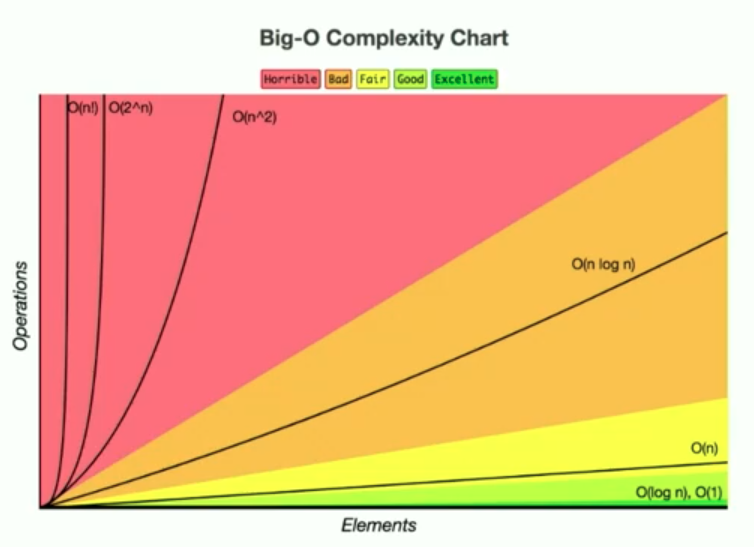

# Intro to algorithms

Repository based on Frontend Masters course `A Practial Guide to Algorithms with Javascript` - (Link)[https://frontendmasters.com/courses/practical-algorithms]

## Concepts

### Space Complexity

How much memory is used?

### Time Complexity

How many primitive operations are executed?

- With respect to input size
- Assuming worst case scenarios

### Table of comparisons between complexity algorithms

| BigO name      | # of operations | Algorithm |
| ----------- | ----------- | ----------- |
| O(n^2), quadratic      | n^2       | Compare all numbers       |
| O(n), linear   | 2n        | Find min and max numbers       |
| O(1), constant   | 2        | Sorted list, find first and last       |

### All complexity algorithms (fastest -> lowest)

| Constant | Logarithmic | Linear | Quadratic | Exponential |
|----------|-------------|--------|-----------|-------------|
| O(1)     | O(log n)    | O(n)   | O(n^2)    | O(k^n)      |

### Complexity of Common Operations

| Complexity | Operation |
|----------|-------------|
| O(1)     | Running a statement    |
| O(1)     | Value look-up on an array, object or variable    |
| O(log n)     | Loop that cuts problem in half every iteration    |
| O(n)     | Looping through the values of an array    |
| O(n^2)     | Double nested loops    |
| O(n^3)     | Triple nested loops    |

### Space complexity

Space that it takes in memory for an algorithm to complete.

### Time complexity

Time complexity of an algorithm signifies the total time required by the program
to run to completion. The time complexity of algorithms is most commonly expressed
using the big O notation.

Big O notation gives us an industry-standard language to discuss the performance of
algorithms. Not knowing how to speak this language can make you stand out as an
inexperienced programmer.

